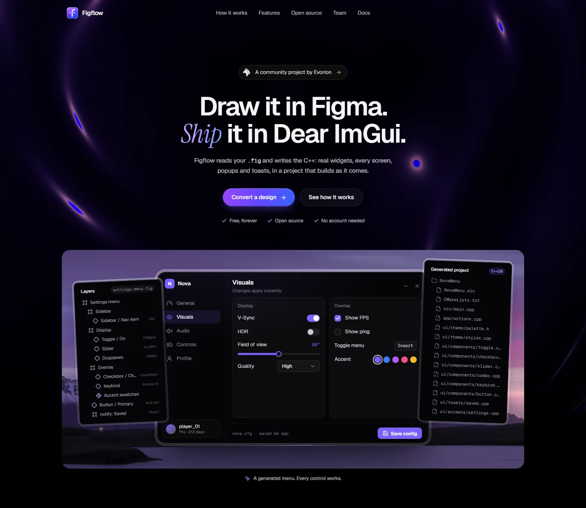
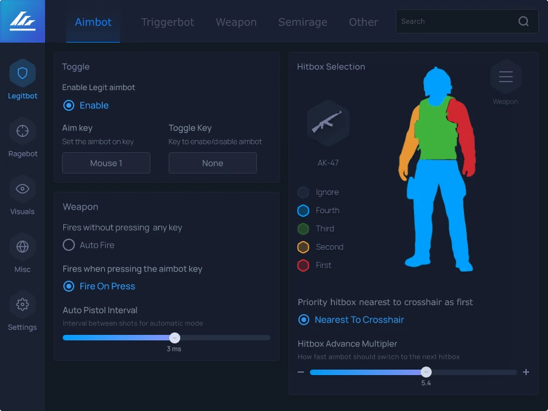
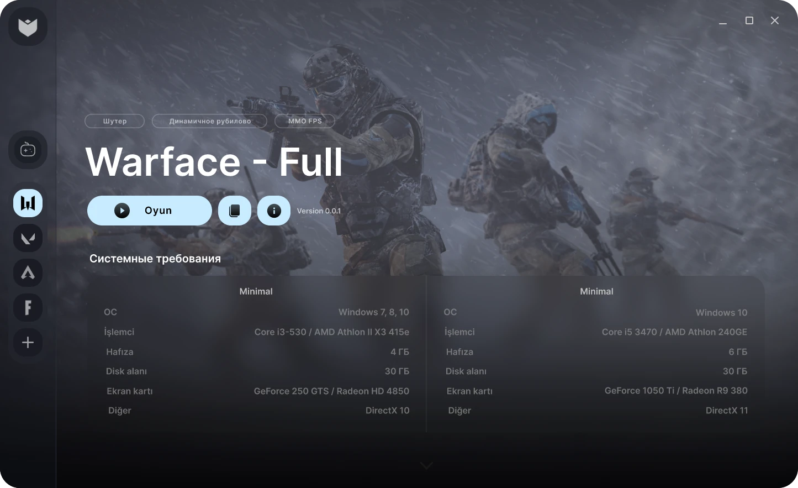
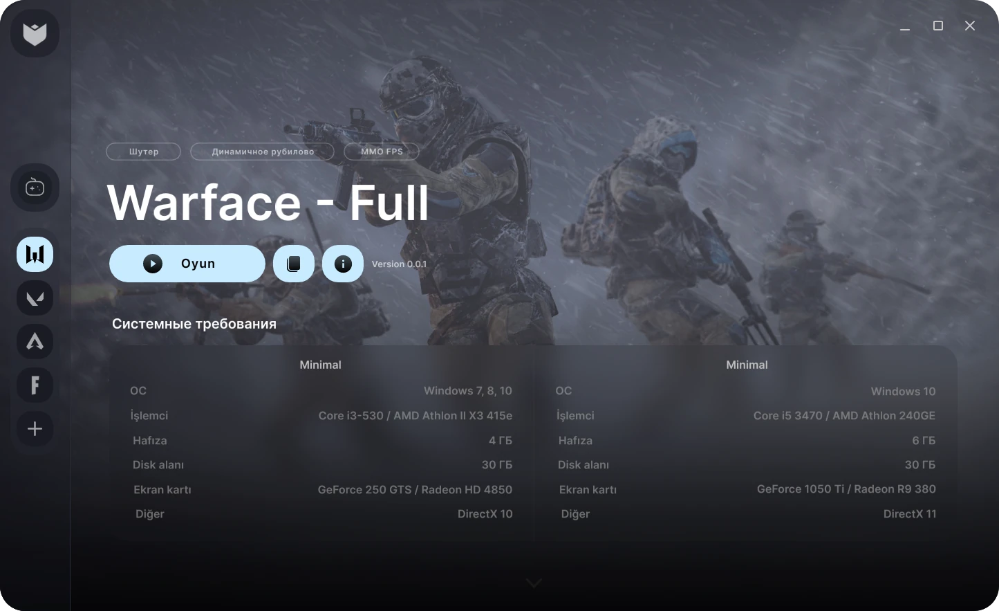
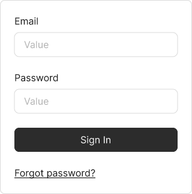
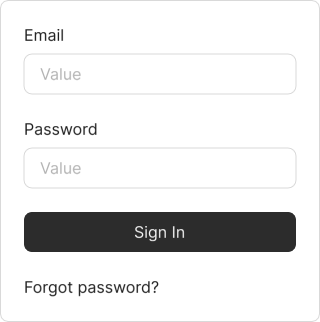
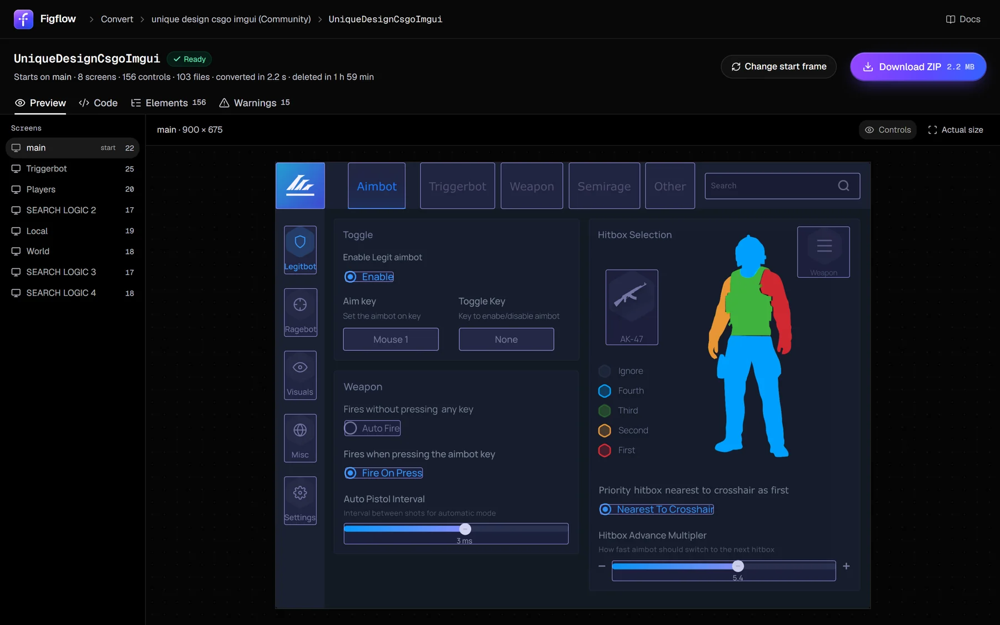
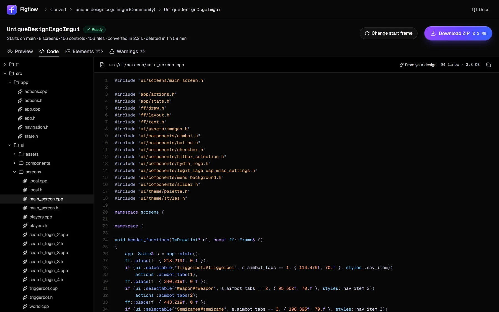

<p align="center">
  
</p>

<h1 align="center">Figflow</h1>

<p align="center"><strong>Figma to Dear ImGui, free and open source.</strong><br />Give it a <code>.fig</code> and get back a Dear ImGui project in C++: real widgets, every screen, popups and toasts, ready to build.</p>

<p align="center">
  
</p>

## Why Figflow

You shouldn't be overcharged to turn your own design into code. Figflow does the whole job and costs nothing: no plans, no credits, no account, no Figma API token.

- **Fast.** An 8-screen menu with 156 controls converts in about two seconds, fonts and images included.
- **Capable.** It converts every screen of the design, not one frame at a time. Prototype links become navigation. Toggles, checkboxes, radios, sliders, drop-downs, key binds, text fields, buttons and tab bars are found by how they look and work in the app. Text keeps Figma's own glyphs, baselines and kerning.
- **Easy to run.** `npm install`, `npm run dev`, drop a `.fig` in the browser. The ZIP builds in Visual Studio 2022 or with CMake as it is.
- **Organised like a hand-built project.** It's structured the way a professional ImGui developer would set it up, not as a wall of draw calls. Details [below](#what-you-get).

## From design to running app

Each pair shows the design on the left. On the right is the generated project, built with MSVC and captured from the running app.

| Figma design | Generated Dear ImGui app |
| --- | --- |
|  |  |
|  |  |
|  |  |

Pixel match between the two: 99.64% (menu), 99.92% (loader), 99.47% (form), counting pixels whose colour differs by more than 24/255 as misses. Every other screen of those designs converts too: the menu has 8, the loader 12. Designs are credited in [THIRD_PARTY_NOTICES.md](THIRD_PARTY_NOTICES.md).

## The converter

Drop a `.fig` and Figflow picks the frame your app starts on, then shows every screen with the controls it found outlined. Click one to see its variable and code.

<p align="center">
  
</p>

<p align="center">
  
</p>

## What you get

```text
MyMenu/
├─ MyMenu.sln · MyMenu.vcxproj · CMakeLists.txt
├─ src/
│  ├─ main.cpp            the Win32 + DirectX 11 host: app::init, then app::frame every frame
│  ├─ app/                state.h (one struct), actions.cpp (what buttons do), navigation
│  └─ ui/
│     ├─ components/      button.cpp, slider.cpp, checkbox.cpp… plus the panels screens share
│     ├─ screens/         one file per screen, each part of it a function
│     ├─ popups/ toasts/
│     ├─ theme/           palette.h (named after your variables), styles.cpp, fonts.cpp
│     └─ assets/          fonts.cpp, icons.cpp, images.cpp: byte arrays, nothing to ship beside the exe
├─ ff/                    the small runtime: drawing, text, images, animation
└─ third_party/           Dear ImGui 1.92
```

- **Widgets written like Dear ImGui's own:** `ItemSize`, `ItemAdd` and `ButtonBehavior`, with the design's looks for idle, hovered, pressed and selected blended over time.
- **State is plain data.** A toggle is a `bool`, a slider a `float` with the design's range, a text field a `char[256]`, each named after its label.
- **Nothing to clean up.** No comments to strip, no magic names: controls, styles and colours take their names from your layers, labels and variables.

## Quick start

You need Node.js 22.12 or newer. To build the generated projects on Windows: Visual Studio 2022 with the C++ desktop workload, or CMake 3.20+ with MSVC.

```bash
npm install
npm run dev
```

Open http://localhost:3000/convert and drop a `.fig` in. In Figma, **File → Save local copy…** gives you one.

From the command line, convert the app that starts on one frame (by name or id):

```bash
npx tsx scripts/generate.ts design.fig "Frame name" out/MyMenu --name MyMenu
```

Then open `out/MyMenu/MyMenu.sln`, or build with CMake:

```bash
cmake -S out/MyMenu -B out/MyMenu/build
cmake --build out/MyMenu/build --config Release
```

To check a conversion end to end (generate, build with MSVC, capture the running app and compare it with the design):

```bash
npx tsx scripts/e2e.ts design.fig "Frame name" work/
```

## How it's put together

| Path | What's there |
| --- | --- |
| `src/engine/fig` | Reads the `.fig` archive (Kiwi schema, adapted from Grida) and builds the design tree, with instances expanded and overrides applied. |
| `src/engine/semantic` | Finds the app in the design: screens, navigation, popups, toasts and controls. |
| `src/engine/codegen` | Plans the drawing, bakes the artwork Dear ImGui can't draw, resolves fonts and writes the C++ project. |
| `src/engine/render` | The reference SVG renderer, for previews and as the oracle builds are compared against. |
| `runtime/` | The C++ copied into every project (`ff/`, `ui/components/`), plus Dear ImGui, stb and Inter. |
| `src/server`, `src/app` | The website and the converter. Each upload is read in a worker process of its own. |
| `scripts/` | Command-line tools: `generate`, `e2e`, `compare`, `flow`, `smoke`, `fig-inspect`, `fig-render`, `fig-tree`. |

`npm test` runs the unit tests, `npm run typecheck` and `npm run lint` the checks.

## Contributing

Designs that convert badly are the most useful thing you can send. Open an issue with the `.fig` (or a trimmed copy) and the frame's name. Pull requests are welcome.

## License

Figflow is source-available under the [PolyForm Shield License 1.0.0](LICENSE.md). Use it for anything, including commercial work, except selling Figflow itself or building a product that competes with it.

The runtime copied into generated projects is [MIT No Attribution](runtime/LICENSE.txt), so what you generate is yours to ship. Third-party code, fonts and images keep their own licenses: see [THIRD_PARTY_NOTICES.md](THIRD_PARTY_NOTICES.md).

Made by Shadow at [Evorion Labs](https://evora.cx). Not affiliated with Figma, Inc. or the Dear ImGui project.
